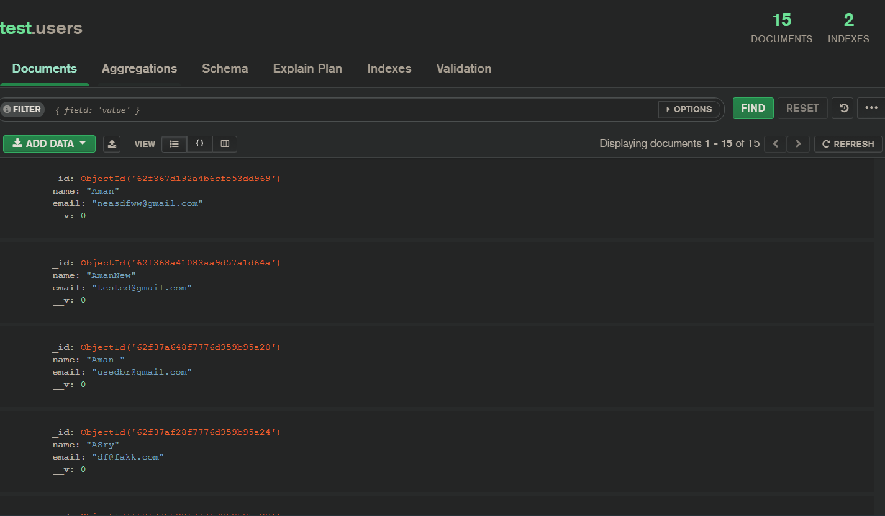
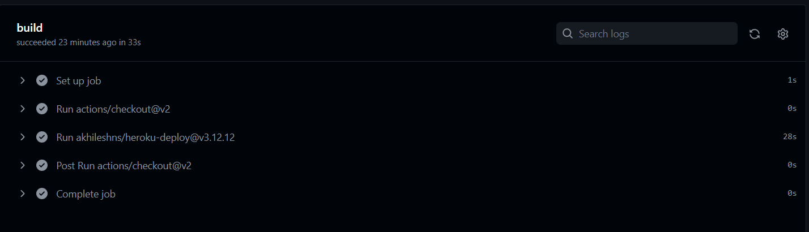
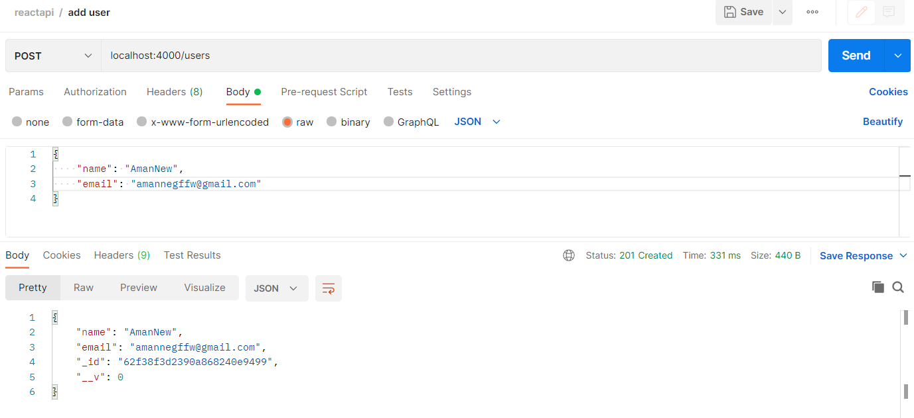
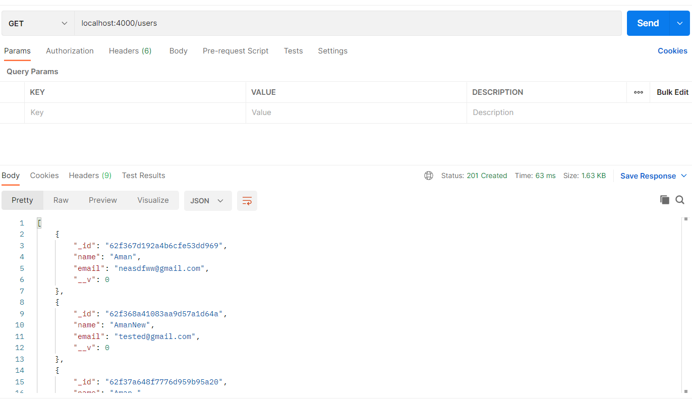
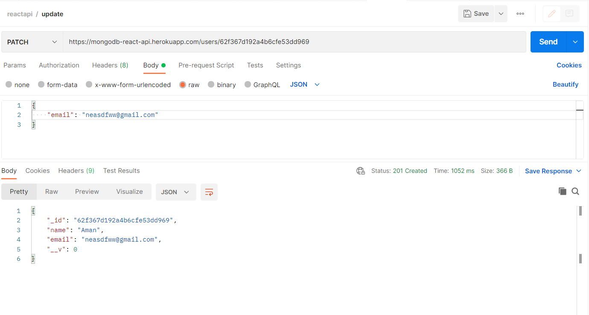

# react-assessment-2

used MongoDB as database

Used Github Actions for CI/CD to Heroku

Tested the Deployed/Local APIs using any API Testing tool Postman

Add User

Get All User

Update User Data
